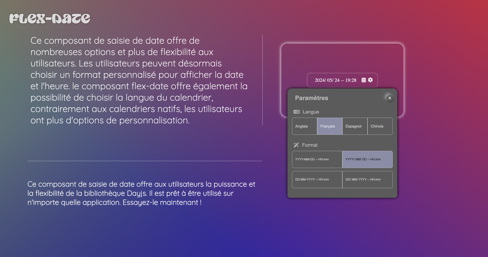

# Angular 16

This project was generated with [Angular CLI](https://github.com/angular/angular-cli) version 13.1.2.

# Taking Control over Input-date design

More than having full control over the design, It also allows users to have more flexibility provided by Dayjs.
Users can edit the date-picker language && the displayed date format.

## Development server

Run `ng serve` for a dev server. Navigate to `http://localhost:4200/`. The app will automatically reload if you change any of the source files.

## Further help

To get more help on the Angular CLI use `ng help` or go check out the [Angular CLI Overview and Command Reference](https://angular.io/cli) page.
